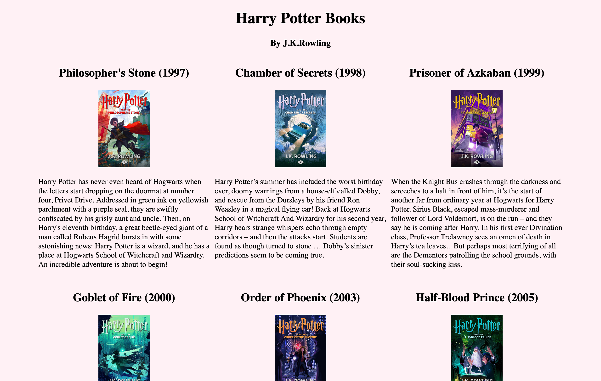

# Harry Potter Books Webpage

## Overview

This is a webpage displaying book summaries of all seven Harry Potter books written by J.K. Rowling. Click [here](http://flora8heart.github.io/hp-books-webpage) for a live preview of the webpage.

**Screenshot**

## Built With

- HTML
- CSS
- Javascript

### Design

Used CSS grid layout to place all seven elements consisting of the book title, book image and book summary in a grid layout.

**CSS Grid Layout**

### Features

An interactive button programmed with Javascript is placed at the bottom of the website. Upon clicking on the button, the background color will be changed from pastel pink to pastel purple and so forth.

**Button Demo**

